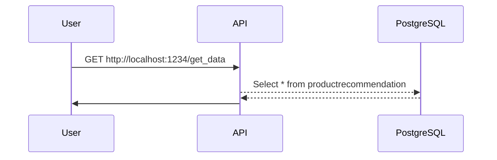
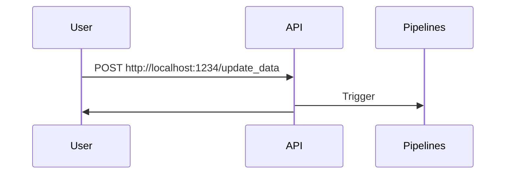
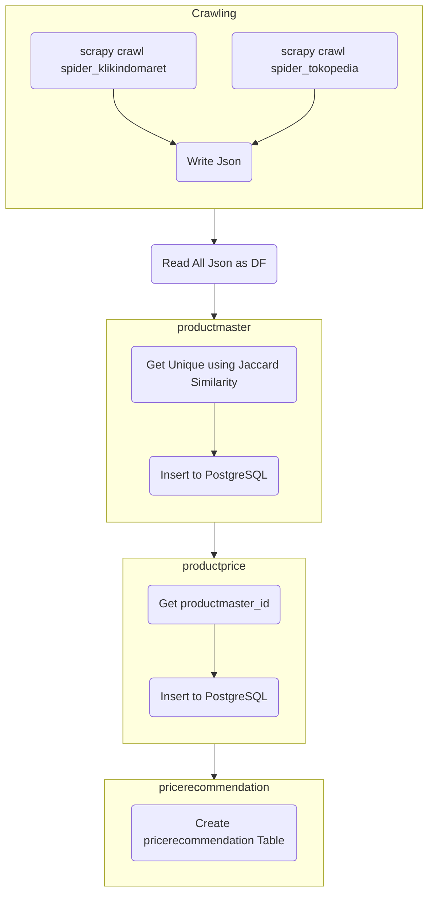

# Python Crawler
## FLowchart
### GET

### POST

### Pipelines


## Deployment
### Setup
- Check configuration at [`requirements/config.json`](https://github.com/annangsyarif/python-crawler-example/blob/main/requirements/config.json)
- Check scrapy settings at [`python_crawler/settings.py`](https://github.com/annangsyarif/python-crawler-example/blob/main/python_crawler/settings.py) especially for selenium configuration

### Running Locally
```shell
# build the image
$ docker build -t python-crawler-app:latest . 

# compose
$ docker-compose up -d
```

Create `crawling_database` database at PostgreSQL and initiate the table with the following command:

```sql
CREATE TABLE public.pricerecommendation (
	productmaster_id int4 NULL,
	pricerecommendation float8 NULL,
	"date" timestamptz NULL
);
```

```sql
CREATE TABLE public.productmaster (
	id serial NOT NULL,
	"name" varchar NULL,
	detail varchar NULL,
	tokens _text NULL,
	occurrences _text NULL,
	CONSTRAINT productmaster_pkey PRIMARY KEY (id)
);
```

```sql
CREATE TABLE public.productprice (
	"_id" serial NOT NULL,
	"name" varchar NULL,
	price float8 NULL,
	originalprice float8 NULL,
	discountpercentage float8 NULL,
	detail varchar NULL,
	platform varchar NULL,
	productmaster_id int4 NULL,
	createdat varchar NULL,
	CONSTRAINT productprice_pkey PRIMARY KEY (_id)
);
```
## API Documentation
### GET
- ```http://localhost:1234/get_data```

	```json
	{
		"data": [
			{
				"date": "Sat, 23 Dec 2023 16:13:38 GMT",
				"pricerecommendation": 29500.0,
				"productmaster_id": 55
			},
			{
				"date": "Sat, 23 Dec 2023 16:13:38 GMT",
				"pricerecommendation": 62900.0,
				"productmaster_id": 148
			},
			.
			.
			.
		]
	}
	```
### POST
- ```http://localhost:1234/update_data```
	```json
	{
		"status": "success",
		"message": "Update Successfully"
	}
	```
